# Tubes 2 IF3210 Pengembangan Aplikasi pada Platform - UNITY

# Adventure of 4R-JUNA

Pasca kepunahan manusia akibat invasi monster, sebuah robot canggih bernama 4R-JUNA diciptakan oleh kecerdasan buatan terakhir yang tersisa untuk membasmi para monster. Di tengah hutan yang sunyi, 4R-JUNA menargetkan sebuah skeleton yang sedang tertidur sendirian. Dalam usahanya untuk mengeliminasi skeleton dengan senjatanya, tembakannya malah membangunkan sekawanan skeleton lainnya. Kawanan skeleton tersebut memulai pengejarannya terhadap 4R-JUNA.

## Screenshots

#### Main Menu

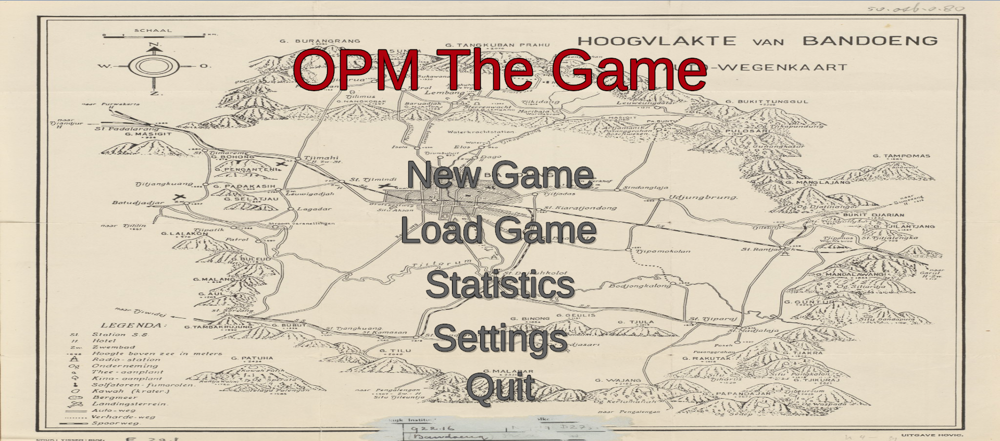

#### Settings

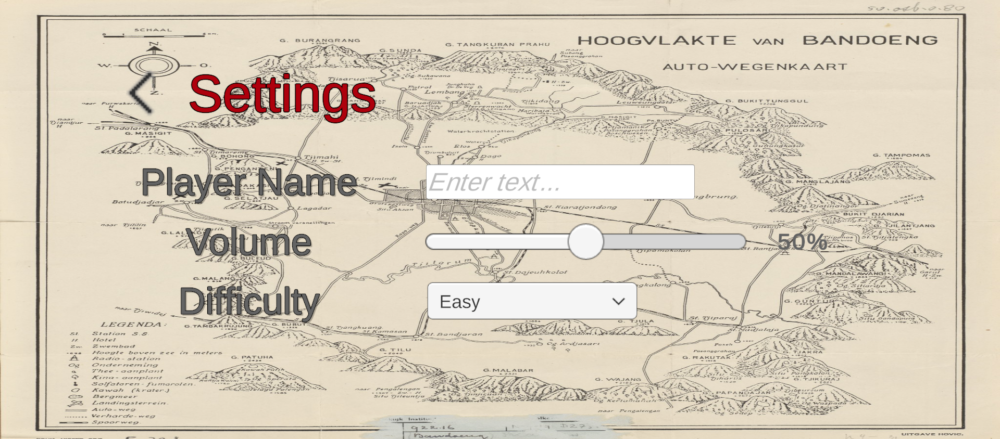

#### Load Game

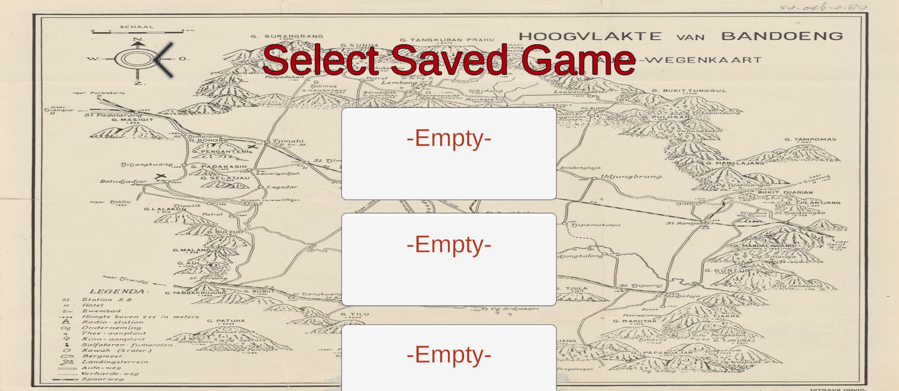

#### Save Game

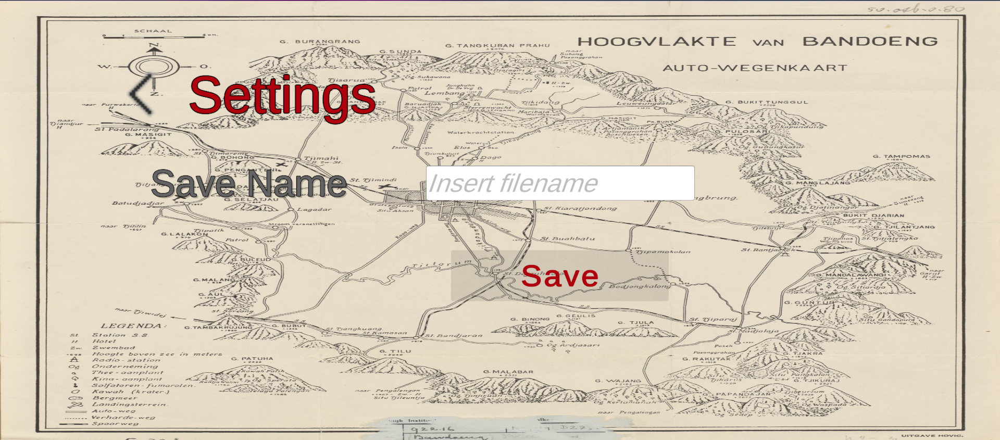

#### Save Game

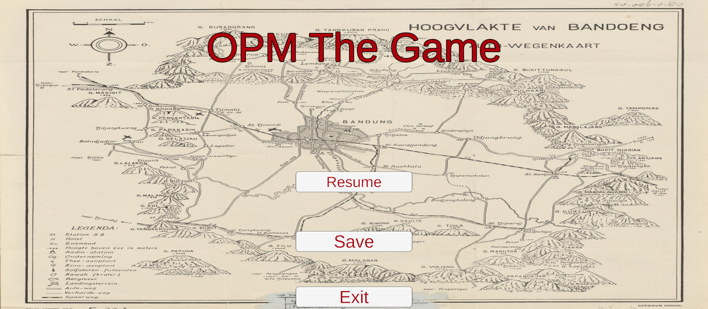

#### Gameplay

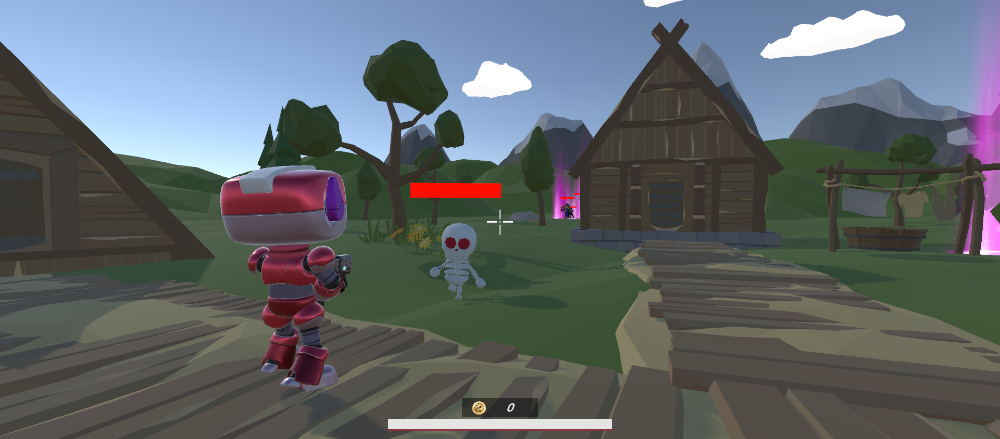
 
 
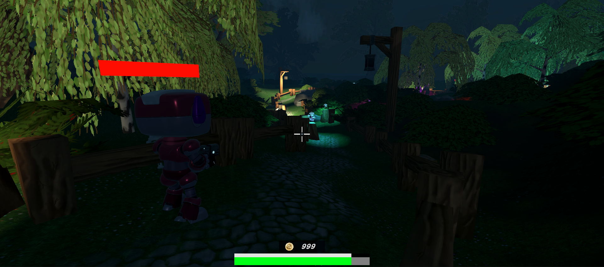
 
 
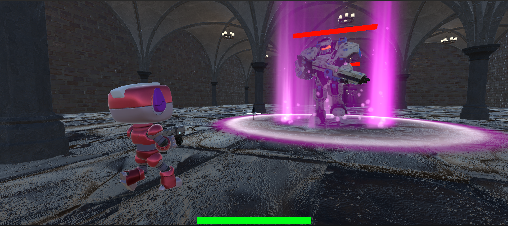

#### Shop

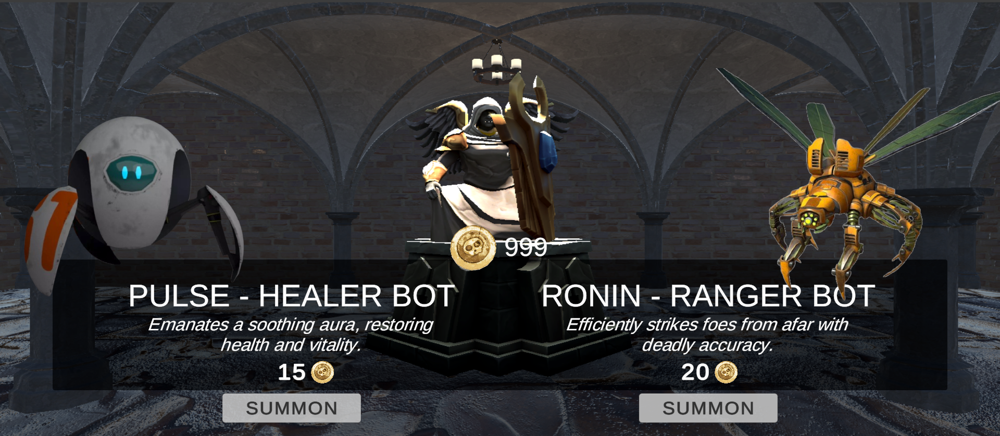

#### Cutscenes

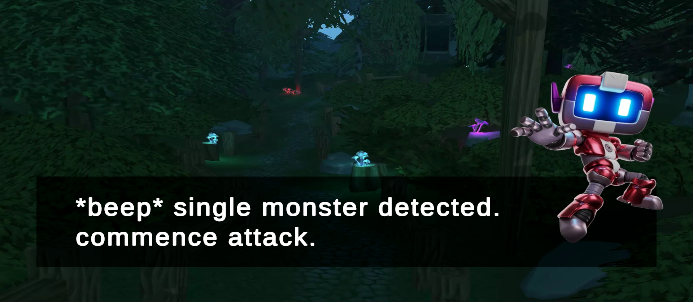
 
 
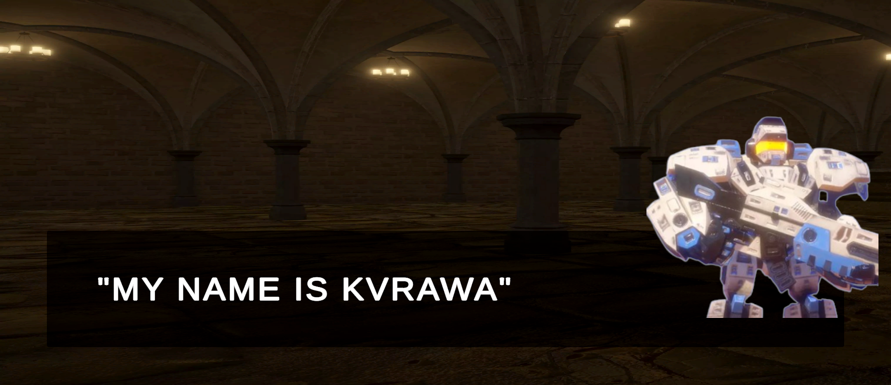
 
 
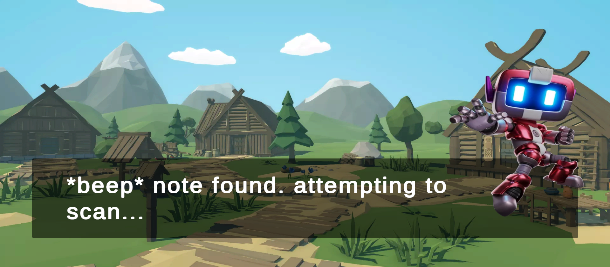

## Fitur

1. Story Mode
2. Save & Load Game
3. Game Over
4. Statistik
5. Main Menu
6. Shopkeeper
7. Weapon
8. Pet
9. Cheat
10. Mobs
11. Orbs

## Anggota Kelompok

## Job Description

| No. |                  Name                  |                                Job Desc                                 | Hours Spent |
|:---:|:--------------------------------------:|:-----------------------------------------------------------------------:|:---------:|
| 1.  |  Irsyad Nurwidianto Basuki (13521072)  |                Jendral, Level 1, Save/Load, Orbs, Pause                 |     100   |
| 2.  |       Bagas Aryo Seto (13521081)       |         Shop, All Cuscene, Efek sound, All Environment, Effect          |     100   |
| 3.  |    Rizky Abdillah Rasyid (13521109)    |  Player, Kepala Kroco, Raja, Pet increase, Initial Setup, Health enemy  |     100   |
| 4.  |   Muhammad Rizky Sya'ban (13521119)    | Player weapon, Pet Attacker, cheat, quest, spawner enemy, scene manager |     100   |
| 5.  | Muhammad Abdul Aziz Ghazali (13521128) |    Game Menu, Statistik, Kroco, PetManager, Pet healer, koin prefabs    |     100   |
| 6.  |      Tazkirah Amaliah (10023608)       |                           Initial Story line                            |     1     |
